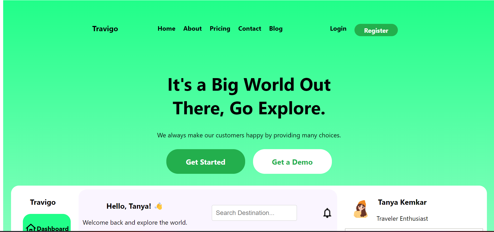
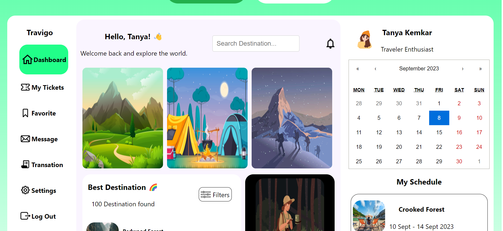
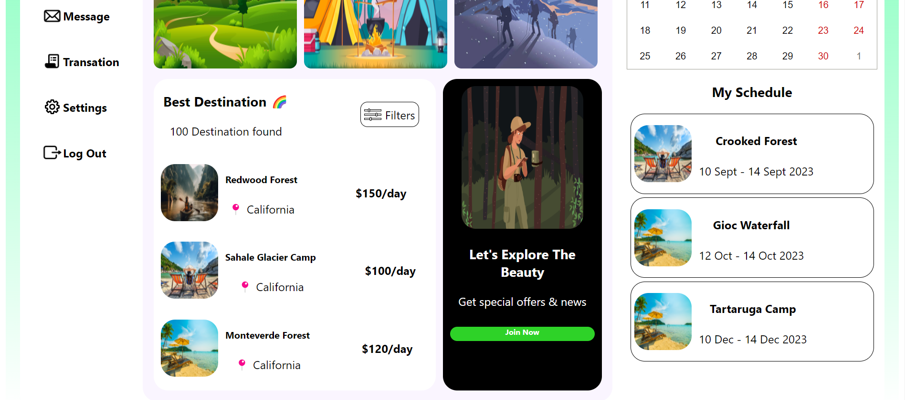

## Cloning and starting application
1. - git clone https://github.com/kemkartanya/travigo-app.git
1. - cd travigo-app
2. - npm install
4. - npm start  //STARTS REACT SERVER  

**snapshots of app**

